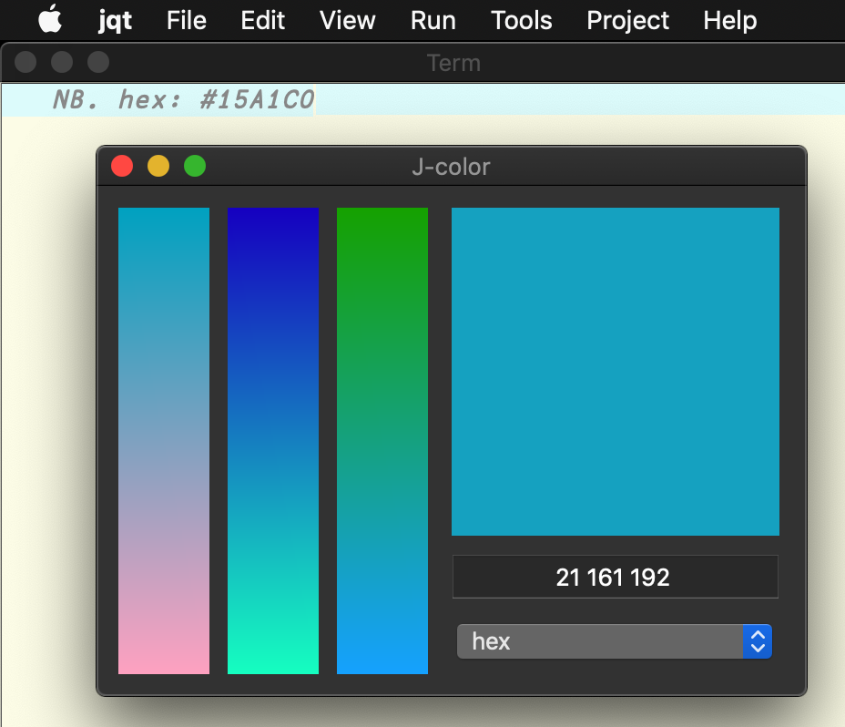

This is a program for a simple color picker. This file also serves as some brief notes about using J's `wd` (window driver) for writing qt guis.


# Idea

Pick colors by clicking three strips representing the color in RGB. Also use a text edit area to adjust colors. To get, say something yellowish, one can click somewhat far down the red strip and somewhat far down the green strip. The created color shows is displayed in a larger square box. Clicking this box has the effect of copying the RGB value to the clipboard. There's also a selectionlist form to ask for different color formats.

This is like walking along the RGB color space where vertices are colors and edges point between colors that share 2/3 RGB values. The way colors are displayed in the strips makes displays the range of possible colors keeping 2 the same, which I find helpful.




# Imports/Names

`jgl2` (graphics driver) and `viewmat` are used for drawing.

```j
coclass 'jcolor'
require 'viewmat'
coinsert'jgl2 jviewmat'
```


# Parent Form and State

See the [Window Driver](https://code.jsoftware.com/wiki/Guides/Window_Driver) guide at jsoftware.com for accurate and detailed information.

In jqt, `wd 'pc id'` creates a parent form. Child may be added to parent forms. This color picker uses three `isidraw` child forms to draw RGB color strips and one more to show the output color/copy to clipboard. There's `edit` form to see and edit the rgb value. Lastly, there's a `combolist` to choose an output format.

The parent form is called `rgbw` for rgb window.

Program state is stored in a global variable `COLOR`, initially \(0 0 0\). A handler for closing the window is specified with the name `rgbw_close`.

```j
COLOR=: 0 0 0
HISTORY=: ,:0 0 0
HISTSIZE=: 10

rgbw_form=: 0 : 0
pc rgbw; pn "J-color";
bin h;
  cc pickr isidraw; set pickr wh 50 256;
  cc pickg isidraw; set pickg wh 50 256;
  cc pickb isidraw; set pickb wh 50 256;
  bin v;
    cc showc isidraw; set showc wh 180 180;
    cc rgbc edit; set rgbc wh 180 25; set rgbc alignment center;
      set rgbc regexpvalidator \d{,3}(\s\d{,3}){2,2};
    cc copyt combolist; set copyt items rgb hex;
    cc histt combolist; set histt items "0 0 0";
  bin z;
bin z;
pshow;
)

rgbw_close=: 3 : 0
wd'psel rgbw;pclose;'
wd 'clipcopy ',": COLOR
)
```


# Children

Event handlers can be added for children forms under the naming scheme `parentid_childid_eventid`. Here, the parent is `rbgw` and all even handlers are named `rgbw_somechild_someevent`.


## isidraw

Isidraw forms allow one to use `gl2` commands or `viewmat` to draw to areas of the window. The three strips `pickr`, `pickg`, and `pickb` will preview the possible colors. Clicking the top of the strip will set the color to 0, clicking the bottom will set it to 255.

The output `isidraw` is called `showc` and clicking it will save the color in the clipboard.

The event used is `mblup` (left mouse button up). When this happens the location of the mouse up on the strips determines the next color. For `showc` no location information is needed; by default the string of the 3-vector `COLOR` is formatted then copied.

```j
rgbw_pickr_mblup=: 3 : '0 adjust_color'
rgbw_pickg_mblup=: 3 : '1 adjust_color'
rgbw_pickb_mblup=: 3 : '2 adjust_color'
rgbw_showc_mblup=: 3 : 'wd ''clipcopy '',": COLOR'

record_hist=: 3 : 0
HISTORY=: ~. (<./HISTSIZE,>:#HISTORY) {. COLOR , HISTORY
wd 'set histt items',,/(' ','"'&,@,&'"'@":)"1 HISTORY
)

adjust_color=: 1 : 0
COLOR=:(3#0)>.((1{".sysdata)(m})COLOR)<.3#255
update''
)
```

`adjust_color` grabs location information held in name `sysdata`. noun `m` is which color to ammend (`}`), 0 for red, 1 for green, 2 for blue.

This value is clamped between 0 and 255 in case the mouse was dragged out of bounds. Worth remembering is `sysdata` (for `isidraw`) indicates `x` then `y` coordinates and `1 { ".sysdata` does will give height to use to pick color.


### isidrawing

`update` ensures parent window is selected `psel rgbw`. For each child use values of `COLOR` preview possibilities with `render_child`.

For example, take green. The main work is done with `((i.256)&(1})&.|:(256 3$COLOR))viewmatcc(i.256 50);'pickg'`.

The color palette used by `viewmatcc` is constant `COLOR` with 1st row (green) ammended to with values 0 to 255. The 256 by 50 matrix that gets drawn can then be (`i.256 50`) with the appropriate rgb color going at each row.

```j
update=: 3 : 0
record_hist''
wd'psel rgbw'
render_child(2;'pickb')[render_child(1;'pickg')[render_child(0;'pickr')
glpaint''[glfill (COLOR,255)[glclear''[glsel'showc'
wd'set rgbc text "',(":COLOR),'"'
)

render_child=: 3 : 0
glclear''[glsel child[wd'psel rgbw'['column child'=. y
((i.256)&(column})&.|:(256 3$COLOR))viewmatcc(i.256 50);child
glpaint''
)
```


## edit

An edit area shows the current rgb value for `COLOR`. It has a regexpvaildator which on one hand feels like overkill, but on the other reduces the frequency of erros when reading the color (`". get rgbc text''`).

The event here is button which fires when `return` is pressed and updates `COLOR` to the new value. All drawings subsequently updated.

```j
rgbw_rgbc_button=: 3 : 'update[COLOR=: (3#0)>.(".wd''get rgbc text'')<.3#255'
```


## combolist

Combo list makes it possible to change output format to hex. The event is `select`.

It works by modifying the definition of the event handler for `showc_mblup`.

`hex` works by antibasing (`#.^:_1`) in base 16, selecting into string `01234567890ABCDEF`, padding with `0` (in case of very dark colors to ensure 6 characters in output), taking last two columns, then finally raveling.

```j
rgbw_copyt_select=: 3 : 0
select. copyt
case. 'hex' do. rgbw_showc_mblup=: 3 : 'wd ''clipcopy #'',": hex COLOR'
case. 'rgb' do. rgbw_showc_mblup=: 3 : 'wd ''clipcopy '',": COLOR'
end. 'ok'
)

rgbw_histt_select=: 3 : 0
COLOR=: ". histt
update''
)

hex=: [:,[:_2&{."1[:'000'&,.[:":[:{&'0123456789ABCDEF'16&(#.^:_1)
```


# main

Only runs if inside jqt (these days `wd` only works there).

```j
courir=: 3 : 0
if. IFQT do. update[wd rgbw_form[rgbw_close^:(wdisparent'rgbw')''
else. echo 'needs qt' end.
)

courir''
```


# todo

Polish up to put in jqt program menu jqt and make distributable as an addon.


# addon

I'll definitely forget these details. OK, so J distributes packages as addons. These are mostly managed through `pacman`. The structure of these packages is laid out in the [manifest](manifest.ijs) wherein we specify:

-   **CAPTION** brief about
-   **DESCRIPTION** more about
-   **VERSION**
-   **DEPENDS** we depend on gl2 and viewmat
-   **FILES** It's just [jcolor.ijs](jcolor.ijs) and [run.ijs](run.ijs) who loads `jcolor.ijs`.
-   **RELEASE** I put j901 since that's what I used.
-   **FOLDER** Can be an existing one or is based on github user. I avoided indulging in too much hubris by naming this something generic and scoped it to me.

Having defined run.ijs, I am able to type `[f9]` in jqt to start things, which is fun.
